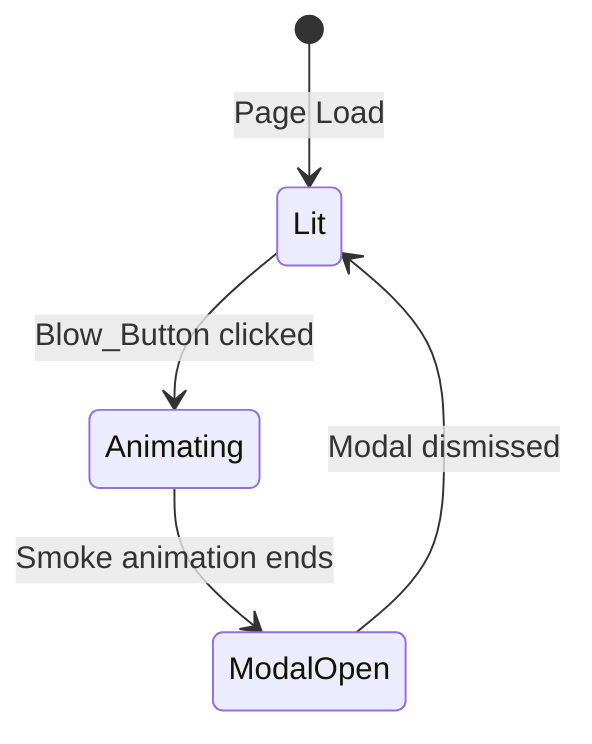
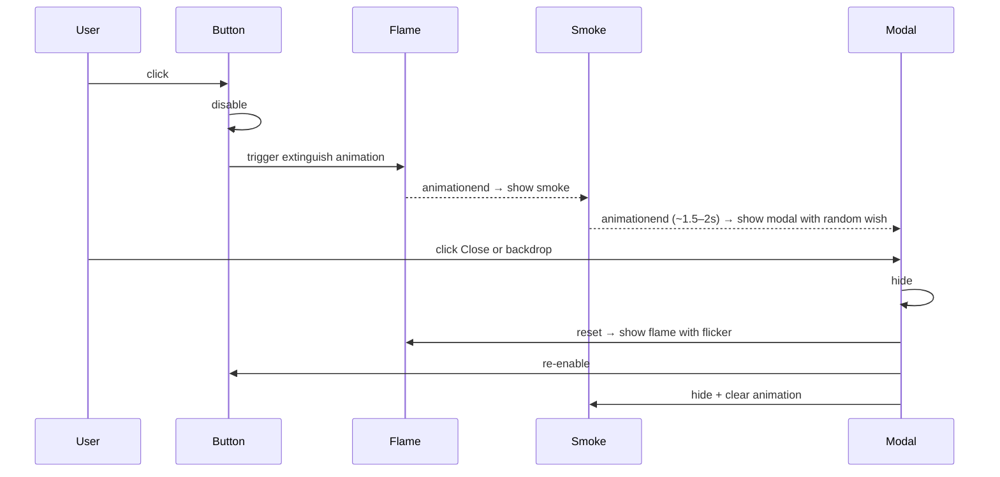

# Design Document: Happy Birthday - Blow the Candle

## Overview

A single-page birthday website built with HTML5, Tailwind CSS (CDN), and vanilla JavaScript. The page features a pixel-art birthday cake with an animated flickering candle. Clicking "Blow the Candle" triggers a sequenced animation (extinguish → smoke → modal with random wish). Dismissing the modal resets the candle to its lit state so the user can repeat the experience.

The project is structured as three files (`index.html`, `style.css`, `script.js`) for maintainability and GitHub readiness.

---

## Architecture

The application follows a simple three-layer architecture within a static site:

```
index.html      ← Markup: DOM structure, elements, and CDN links
style.css       ← Styles: Tailwind extensions, pixel-art classes, CSS keyframe animations
script.js       ← Logic: State machine, event handlers, animation sequencing
```

There is no build step, server, or external runtime dependency beyond a browser and a CDN connection for Tailwind CSS and Google Fonts.

### State Machine

The core interaction is modeled as a simple two-state machine with transitions:



| State | Blow_Button | Flame | Smoke | Wish_Modal |
|---|---|---|---|---|
| `Lit` | enabled | visible + flickering | hidden | hidden |
| `Animating` | disabled | extinguishing → hidden | rising → fading | hidden |
| `ModalOpen` | disabled | hidden | hidden | visible |
| `Lit` (after Reset) | enabled | visible + flickering | hidden | hidden |

### Animation Sequence



---

## Components and Interfaces

### 1. `index.html` — DOM Structure

```html
<!-- Structure outline -->
<body>
  <!-- Background layer -->
  <div id="bg-pattern"><!-- pixel confetti / balloon SVG pattern --></div>

  <!-- Main content card -->
  <main id="app">
    <h1 id="title">Happy Birthday to You!</h1>

    <!-- Cake illustration -->
    <div id="cake-wrapper">
      <div id="cake">
        <!-- Candle -->
        <div id="candle">
          <div id="wick"></div>
          <div id="flame"></div>   <!-- hidden via class when unlit -->
          <div id="smoke"></div>   <!-- hidden via class when not smoking -->
        </div>
        <!-- Cake tiers (CSS pixel art) -->
        <div id="cake-tier-top"></div>
        <div id="cake-tier-bottom"></div>
      </div>
    </div>

    <p id="prompt-text">Make a wish before you blow the candle</p>

    <button id="blow-btn">Blow the Candle 🎂</button>
  </main>

  <!-- Wish Modal -->
  <div id="modal-backdrop" class="hidden">
    <div id="modal">
      <p id="wish-text"></p>
      <button id="close-btn">Close</button>
    </div>
  </div>
</body>
```

### 2. `style.css` — Visual Design and Animations

#### Color Palette (CSS custom properties)

```css
:root {
  --color-cream:       #FFF8F0;
  --color-peach:       #FFBFA0;
  --color-soft-orange: #FF8C42;
  --color-light-brown: #C68642;
  --color-pastel-pink: #FFB3C6;
  --color-shadow:      #8B5E3C;
}
```

#### Pixel Button Style

```css
.pixel-btn {
  border: 4px solid var(--color-shadow);
  box-shadow: 4px 4px 0px var(--color-shadow);
  border-radius: 0;
  font-family: 'Press Start 2P', monospace;
}
.pixel-btn:hover {
  box-shadow: 6px 6px 0px var(--color-shadow);
  transform: translate(-1px, -1px);
}
.pixel-btn:active {
  box-shadow: 1px 1px 0px var(--color-shadow);
  transform: translate(3px, 3px);
}
```

#### CSS Keyframe Animations

**Flame Flicker** (infinite loop, lit state):
```css
@keyframes flicker {
  0%   { transform: scaleX(1)   scaleY(1)    rotate(-2deg); opacity: 1; }
  25%  { transform: scaleX(0.9) scaleY(1.05) rotate(2deg);  opacity: 0.9; }
  50%  { transform: scaleX(1.1) scaleY(0.95) rotate(-1deg); opacity: 1; }
  75%  { transform: scaleX(0.95) scaleY(1.1) rotate(1deg);  opacity: 0.85; }
  100% { transform: scaleX(1)   scaleY(1)    rotate(-2deg); opacity: 1; }
}
```

**Flame Extinguish** (one-shot, ~0.4s):
```css
@keyframes extinguish {
  0%   { transform: scaleY(1);   opacity: 1; }
  60%  { transform: scaleY(0.3); opacity: 0.6; }
  100% { transform: scaleY(0);   opacity: 0; }
}
```

**Smoke Rise** (one-shot, ~1.7s):
```css
@keyframes smokeRise {
  0%   { transform: translateY(0)   scaleX(1);   opacity: 0.7; }
  40%  { transform: translateY(-20px) scaleX(1.3); opacity: 0.5; }
  100% { transform: translateY(-50px) scaleX(2);   opacity: 0; }
}
```

#### Pixel Cake (CSS art)

The cake tiers are `div` elements styled as colored rectangles with pixel-border outlines, stacked vertically. The candle is a narrow tall rectangle with the flame on top (teardrop `clip-path` or border-radius trick) and the wick as a thin line. Colors follow the palette.

### 3. `script.js` — State Machine and Event Handling

```javascript
// State enum
const State = { LIT: 'lit', ANIMATING: 'animating', MODAL_OPEN: 'modalOpen' };
let currentState = State.LIT;

// Wish pool (10 entries)
const wishes = [ /* ... 10 strings ... */ ];

// Element refs
const blowBtn      = document.getElementById('blow-btn');
const flame        = document.getElementById('flame');
const smoke        = document.getElementById('smoke');
const modalBackdrop = document.getElementById('modal-backdrop');
const wishText     = document.getElementById('wish-text');
const closeBtn     = document.getElementById('close-btn');

// Entry point
blowBtn.addEventListener('click', onBlow);
closeBtn.addEventListener('click', onClose);
modalBackdrop.addEventListener('click', onBackdropClick);

function onBlow() {
  if (currentState !== State.LIT) return;         // guard
  currentState = State.ANIMATING;
  blowBtn.disabled = true;

  // 1. Extinguish flame
  flame.classList.remove('flicker');
  flame.classList.add('extinguish');
  flame.addEventListener('animationend', onExtinguishEnd, { once: true });
}

function onExtinguishEnd() {
  flame.classList.add('hidden');
  // 2. Show smoke
  smoke.classList.remove('hidden');
  smoke.classList.add('smokeRise');
  smoke.addEventListener('animationend', onSmokeEnd, { once: true });
}

function onSmokeEnd() {
  smoke.classList.remove('smokeRise');
  smoke.classList.add('hidden');
  // 3. Show modal with random wish
  wishText.textContent = wishes[Math.floor(Math.random() * wishes.length)];
  modalBackdrop.classList.remove('hidden');
  currentState = State.MODAL_OPEN;
}

function onClose() {
  reset();
}

function onBackdropClick(e) {
  if (e.target === modalBackdrop) reset();   // only backdrop, not modal content
}

function reset() {
  modalBackdrop.classList.add('hidden');
  smoke.classList.add('hidden');
  // Relight candle
  flame.classList.remove('hidden', 'extinguish');
  flame.classList.add('flicker');
  blowBtn.disabled = false;
  currentState = State.LIT;
}
```

---

## Data Models

### Wish Pool

A static JavaScript array of exactly 10 strings. No external data source is used.

```javascript
const wishes = [
  "Wishing you a day filled with love, laughter, and all your favorite things!",
  "May this new year of your life bring you endless happiness and beautiful surprises.",
  "Happy Birthday! May all your dreams and wishes come true this year.",
  "Here's to another year of amazing memories and adventures ahead!",
  "May your birthday be the start of your best year yet, full of joy and success.",
  "Sending you warm wishes and lots of love on your special day!",
  "Happy Birthday! May you be blessed with good health, happiness, and prosperity.",
  "Cheers to you! May this year bring more smiles than tears, and more joy than worries.",
  "Wishing you a wonderful birthday and an even more wonderful year ahead!",
  "Happy Birthday! Never stop shining as bright as you do."
];
```

### Application State

```javascript
// All mutable state is captured in a single variable:
let currentState = 'lit' | 'animating' | 'modalOpen';
// No additional state objects needed — DOM classes ARE the visual state.
```

---

## Correctness Properties

*A property is a characteristic or behavior that should hold true across all valid executions of a system — essentially, a formal statement about what the system should do. Properties serve as the bridge between human-readable specifications and machine-verifiable correctness guarantees.*

### Property 1: Wish selection always draws from the pool

*For any* invocation of the blow-candle sequence, the wish string displayed in the Wish_Modal SHALL be a member of the Wish_Pool (exactly one of the 10 defined wish strings). No wish outside of this set may ever be displayed.

**Validates: Requirements 4.3, 5.1, 5.7**

---

## Error Handling

| Scenario | Handling |
|---|---|
| Blow_Button clicked while `animating` or `modalOpen` | Guard check in `onBlow()` returns early; no state change |
| Backdrop click on modal content (not the backdrop div) | `e.target === modalBackdrop` check prevents accidental close |
| Animation event fires multiple times | `{ once: true }` on `addEventListener` prevents duplicate handlers |
| Google Fonts unavailable (no internet) | Page falls back to system monospace font gracefully; all functionality continues |
| Tailwind CDN unavailable | Layout degrades gracefully; custom CSS in `style.css` provides core visual styles as a fallback baseline |

---

## Testing Strategy

### PBT Applicability Assessment

This feature is primarily a UI state machine with CSS animations and DOM manipulation. Most behavior is specific and example-driven (element presence, class toggling, event sequencing). PBT applies narrowly to the wish selection logic, which is a pure function over an array: `wishes[Math.floor(Math.random() * wishes.length)]`.

### Unit Tests (Example-Based)

Unit tests cover specific states, transitions, and DOM checks:

- **Initial state**: Flame visible with flicker class; Blow_Button enabled; smoke hidden; modal hidden.
- **Post-blow state**: Flame has extinguish animation class; Blow_Button disabled.
- **Post-smoke state**: Modal visible; wish text is non-empty; smoke hidden.
- **Post-reset state**: Flame visible with flicker class; Blow_Button enabled; modal hidden; smoke hidden.
- **Guard behavior**: Clicking Blow_Button while `animating` or `modalOpen` causes no state change.
- **Backdrop click**: Only closes when `e.target` is the backdrop element itself.
- **Wish pool integrity**: `wishes` array has exactly 10 entries; each entry matches the specified string exactly.

### Property-Based Test

**Library**: [fast-check](https://github.com/dubzzz/fast-check) (JavaScript PBT library)

- **Minimum iterations**: 100 per property test run
- **Tag format**: `Feature: birthday-blow-candle, Property {N}: {property_text}`

**Property 1 Test Design**:

Generate `N` independent calls to the wish-selection function (simulating N button presses). For each call, assert the returned value is strictly contained in the `wishes` array. This validates that the random selection can never produce a value outside the pool, across arbitrarily many invocations.

```javascript
// Tag: Feature: birthday-blow-candle, Property 1: Wish selection always draws from the pool
fc.assert(
  fc.property(fc.integer({ min: 0, max: 999 }), (_seed) => {
    const selected = selectRandomWish(wishes);  // pure function extracted from script.js
    return wishes.includes(selected);
  }),
  { numRuns: 100 }
);
```

### Integration / Smoke Checks

- Verify Google Fonts `<link>` tag exists in `<head>`.
- Verify Tailwind CDN `<script>` tag exists in `<head>`.
- Verify `index.html`, `style.css`, `script.js` files all exist.
- Verify all 10 wish strings are present verbatim in the `wishes` array.
